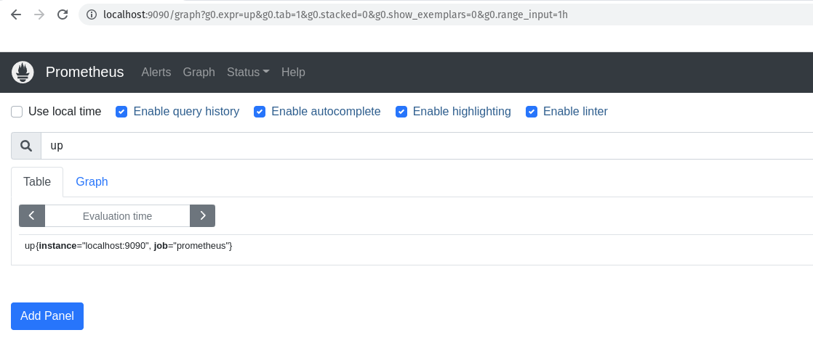
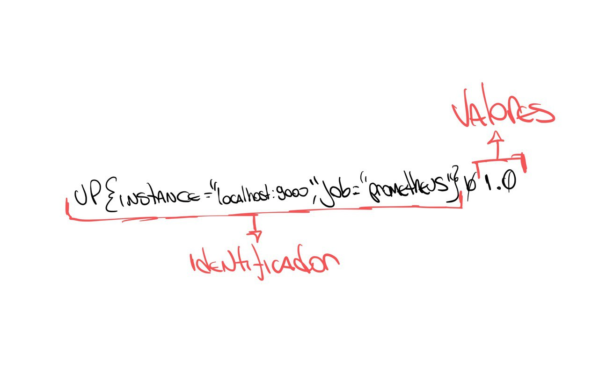
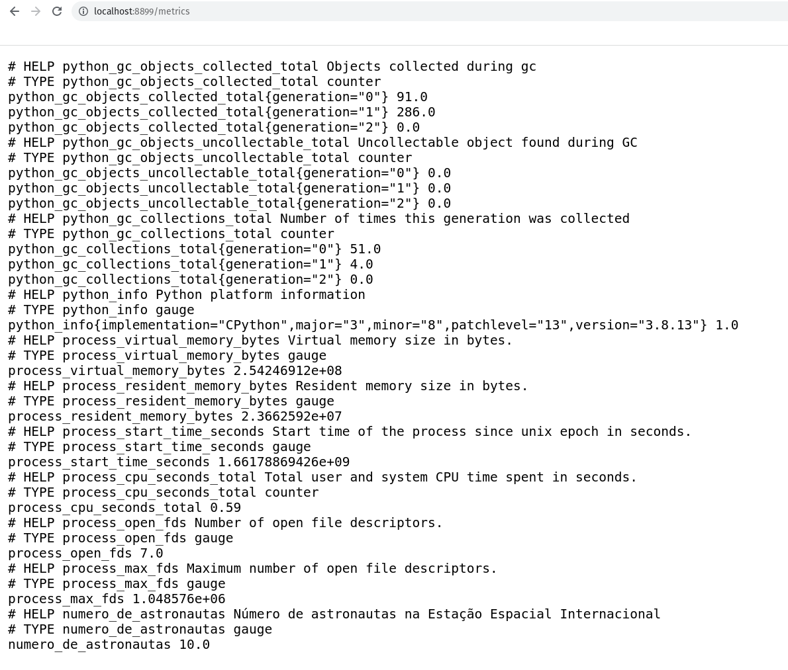
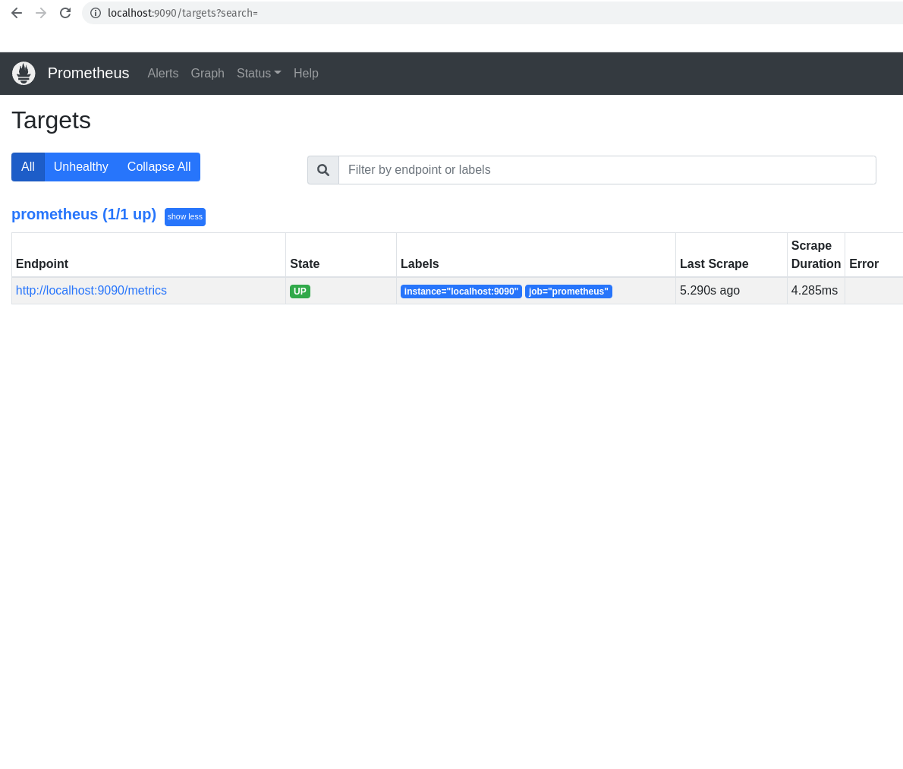
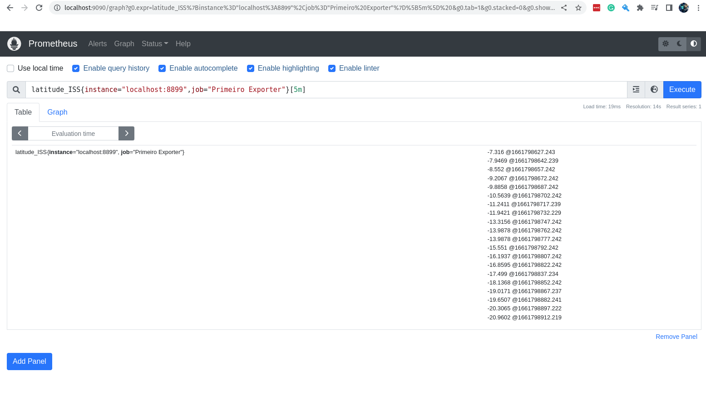

# Descomplicando o Prometheus

## DAY-2

### O que iremos ver hoje?

Seja muito bem-vinda e muito bem-vindo para o seu segundo dia de treinamento! Sim, eu considero esse livro um treinamento e não somente um guia de como obter o melhor do sensacional Prometheus!

Hoje nós vamos aprender como criar as nossa primeiras *queries* e para isso vamos precisar entender o modelo de dados que o Prometheus utiliza, vamos entender no detalhe o que é uma métrica para o Prometheus e vamos aprender como criar a nossa propria métrica e as nossas primeiras queries.

Vamos criar o nosso primeiro exporter utilizando Python Docker. Vamos entender os tipos de dados que o Prometheus utiliza, como utiliza-los e pra que servem.

Vamos conhecer as nossas primeiras funções para que possamos ter ainda mais poderes para criar as nossa queries PromQL.


&nbsp;
### Conteúdo do Day-2

<details>
<summary>DAY-2</summary>

- [O Data Model do Prometheus](#o-data-model-do-prometheus)
- [As queries do Prometheus e o PromQL](#as-queries-do-prometheus-e-o-promql)
- [O nosso primeiro exporter](#o-nosso-primeiro-exporter)
  - [Nosso Primeiro Exporter no Container](#nosso-primeiro-exporter-no-container)
- [Os Targets do Prometheus](#os-targets-do-prometheus)
- [Visualizando as métricas do nosso primeiro exporter](#visualizando-as-métricas-do-nosso-primeiro-exporter)
- [Conhecendo um pouco mais sobre os tipos de dados do Prometheus](#conhecendo-um-pouco-mais-sobre-os-tipos-de-dados-do-prometheus) 
  - [gauge: Medidor](#gauge-medidor)
  - [counter: Contador](#counter-contador)
  - [summary: Resumo](#summary-resumo)
  - [histogram: Histograma](#histogram-histograma)
- [Chega por hoje!](#chega-por-hoje)
- [Lição de casa](#lição-de-casa)
  
</details>

&nbsp;
&nbsp;
### O Data Model do Prometheus

O formato de dados que o Prometheus utiliza é bastante simples, vamos pegar uma métrica e fazer uma consulta para saber o valor atual dela, assim você poderá entender melhor esse tal de *data model*.

Vamos fazer uma query para saber o valor atual da métrica `up` do servidor onde Prometheus está rodando.

```
up
```
&nbsp;

Lembrando que estamos executando a query na porta 9090, que é a porta padrão do Prometheus, lá no navegador, certo?

Somente para que você não tenha duvidas, vamos abrir o navegador e digitar:

```
http://localhost:9090/

```
&nbsp;


Se liga no print do navegador:



&nbsp;


Aqui, o resultado dessa query é:

```
up{instance="localhost:9090",job="prometheus"} 1.0
```
&nbsp;


Nós precisamos entender o que essa linha está dizendo, o Prometheus sempre vai seguir um padrão, e você entendendo essa padrão tudo ficará muito mais fácil.

Ahhh, caso você queira pegar o resultado da query via terminal, basta digitar:

```
curl -GET http://localhost:9090/api/v1/query --data-urlencode "query=up"
```
&nbsp;


Somente para explicar o que a linha do curl acima faz, vamos explicar o que está acontecendo.

&nbsp;

Vamos lá!

- O `curl` é um programa que permite fazer requisições HTTP, ou seja, você pode fazer requisições para uma URL e receber uma resposta. Nesse caso estamos pedindo para que ele faça um GET na URL `http://localhost:9090/api/v1/query` e envie uma query para o Prometheus.

- O `curl` está fazendo uma requisição para a URL `http://localhost:9090/api/v1/query`, que é a URL padrão do Prometheus.

- O `curl` está passando uma query para o Prometheus, que é a query que você estamos querendo saber o valor, ou seja, a nossa métrica `up`. *"query=up"*

- E ainda estamos passando o parâmetro `--data-urlencode` para o `curl`, que é um parâmetro que permite você fazer um  POST com dados via URL, similar ao parâmetro `--data` do `curl`.

&nbsp;


O resultado será algo parecido com a saída abaixo:

```json
{
  "status": "success",
  "data": {
    "resultType": "vector",
    "result": [
      {
        "metric": {
            "__name__": "up",
            "instance": "localhost:9090",
            "job": "prometheus"
            },
        "value": [
            1661595487.119,
            "1"
            ]
        }
        ]
    }
}
```
&nbsp;


Bem, o resultado da query que queriamos já está aqui, mostrei das duas formas, via interface web usando o navegador ou via terminal usando o `curl`.

Agora vamos entender o que está acontecendo.

O que o Prometheus retornou?

Vou fazer rabiscar para eu conseguir explicar melhor. :D

Primeiro vamos entender que o resultado está dividido em duas partes:

- O 'identificador' do resultado, que é o nome da métrica que você está buscando e suas labels. Ahh, as *labels* são informações que ajudam a melhorar o filtro da sua query. Por exemplo, podemos buscar a mesma métrica, mas com diferentes labels, como por exemplo, com o label `instance` como `localhost:9090`, poderíamos ter outras `instance` como `webserver-01` e `webserver-02`, por exemplo.

- O 'valor' do resultado, que é o valor atual da métrica. Essa é a segunda parte do resultado, onde você encontra o valor atual da métrica.

Se liga no desenho que eu fiz para você entender melhor, vamos lá:



&nbsp;


Se der um zoom no desenho, vai ver que o resultado está subdivido em mais partes, afinal, além do nome da métrica, temos as labels e seus valores e finalizando com o valor atual da métrica.

Se liga nesse outro desenho:


&nbsp;


O que sabemos então olhando o resultado dessa query é que o nosso servidor está rodando, ou seja, o Prometheus está funcionando corretamente.
Perceba que somente está o valor '1', não está falando desde quando está em execução, somente trouxe que o valor atual, o que está acontecendo agora é '1', ou seja, está rodando.

Se o valor fosse '0', significaria que o servidor não está rodando, ou seja, o Prometheus está parado.

Agora, se eu quero saber o valor da métrica `up` do servidor onde está rodando o Prometheus na última hora, teriamos que passar esse desejo para a nossa query, que fica assim:

```
up{instance="localhost:9090",job="prometheus"}[1h]
```
&nbsp;


Nesse caso estamos especificando que queremos os valores da métrica `up` do servidor `localhost:9090` do job `prometheus` da última hora, estamos sendo bem específicos. :)

Para pedir as métricas da última hora, vamos usar o parâmetro `[1h]` no final da query.
Você usar `h` para hora, `d` para dia, `w` para semana, `m` para mês, `y` para ano.


&nbsp;


O resultado foi enorme, certo?
E você não sabe o porquê?

Lembra que nós configuramos o Prometheus para ele fazer o *scrape* das métricas que queremos a cada 15 segundos? Então, o resultado vai ser bem grande.

Vou copiar aqui somente o primeiro resultado para você entender melhor:

```
up{instance="localhost:9090", job="prometheus"} 1 @1661595094.114
```
&nbsp;


Perceba que agora ele trouxe o @1661595094.114, que é o timestamp da execução do scrape, ou seja, a hora em que o scrape foi capturado.


Acho que já entendemos o modelo de dados que o Prometheus retorna, então já podemos ir um pouco mais além, bora entender e descomplicar as queries utilizando a poderossa linguagem de query do Prometheus, a PromQL!

&nbsp;
&nbsp;
### As queries do Prometheus e o PromQL

Como mencionado ainda no Day-1, o *PromQL* é uma linguagem de query do Prometheus que permite fazer queries completas e super eficientes, e hoje vamos descomplica-la.

Eu sei que não é nenhuma novidade para você, pois nós já brincamos um pouco durante os exemplos anteriores, mas agora vamos gastar mais energia para que tudo seja mais claro e que possamos ter uma melhor compreensão do PromQL.

Antes de qualquer coisa, vamos colocar mais algumas métricas em nosso servidor, para podermos se divertir um pouco mais.

Antes vamos fazer um novo *exporter* para o Prometheus, o *exporter* é um programa que é executado no host alvo e o responsável por expor as métricas para o Prometheus capturar.

Ahhh, PromQL significa *Prometheus Query Language*. :)

Vamos entender isso melhor, mas antes vamos criar o nosso primeiro *exporter* para o Prometheus.

&nbsp;
&nbsp;
### O nosso primeiro exporter

Para o nosso exemplo, vamos criar uma aplicação bem simples feita em Python irá exportar as métricas que queremos.

A métrica que queremos é a quantidade de pessoas que estão na Estação Espacial Internacional nesse momento.
Então a métrica que queremos é simples, pelo menos por agora:

- Número de astronautas que estão no espaço


Para saber a quantidade de pessoas que estão no espaço, vamos utilizar a API Rest do [OpenNotify](http://open-notify.org/Open-Notify-API/People-In-Space/).

Vamos criar um arquivo chamado `exporter.py` no diretório `exporter`.

&nbsp;


```python
import requests # Importa o módulo requests para fazer requisições HTTP
import json # Importa o módulo json para converter o resultado em JSON
import time # Importa o módulo time para fazer o sleep
from prometheus_client import start_http_server, Gauge # Importa o módulo Gauge do Prometheus para criar a nossa métrica e o módulo start_http_server para iniciar o servidor

url_numero_pessoas = 'http://api.open-notify.org/astros.json' # URL para pegar o número de astronautas

def pega_numero_astronautas(): # Função para pegar o número de astronautas
    try: # Tenta fazer a requisição HTTP
        """
        Pegar o número de astronautas no espaço 
        """
        response = requests.get(url_numero_pessoas) # Faz a requisição HTTP
        data = response.json() # Converte o resultado em JSON
        return data['number'] # Retorna o número de astronautas
    except Exception as e: # Se der algum erro
        print("Não foi possível acessar a url!") # Imprime que não foi possível acessar a url
        raise e # Lança a exceção

def atualiza_metricas(): # Função para atualizar as métricas
    try:
        """
        Atualiza as métricas com o número de astronautas e local da estação espacial internacional
        """
        numero_pessoas = Gauge('numero_de_astronautas', 'Número de astronautas no espaço') # Cria a métrica
        
        while True: # Enquanto True
            numero_pessoas.set(pega_numero_astronautas()) # Atualiza a métrica com o número de astronautas
            time.sleep(10) # Faz o sleep de 10 segundos
            print("O número atual de astronautas no espaço é: %s" % pega_numero_astronautas()) # Imprime o número de astronautas no espaço
    except Exception as e: # Se der algum erro
        print("A quantidade de astronautas não pode ser atualizada!") # Imprime que não foi possível atualizar a quantidade de astronautas
        raise e # Lança a exceção
        
def inicia_exporter(): # Função para iniciar o exporter
    try:
        """
        Iniciar o exporter
        """
        start_http_server(8899) # Inicia o servidor do Prometheus na porta 8899
        return True # Retorna True
    except Exception as e: # Se der algum erro
        print("O Servidor não pode ser iniciado!") # Imprime que não foi possível iniciar o servidor
        raise e # Lança a exceção

def main(): # Função principal
    try:
        inicia_exporter() # Inicia o exporter
        print('Exporter Iniciado') # Imprime que o exporter foi iniciado
        atualiza_metricas() # Atualiza as métricas
    except Exception as e: # Se der algum erro
        print('\nExporter Falhou e Foi Finalizado! \n\n======> %s\n' % e) # Imprime que o exporter falhou e foi finalizado
        exit(1) # Finaliza o programa com erro


if __name__ == '__main__': # Se o programa for executado diretamente
    main() # Executa o main
    exit(0) # Finaliza o programa

```
&nbsp;

Agora vamos executar o nosso script para ver se está tudo certo.

```bash
chmod +x exporter.py
python exporter.py
```
&nbsp;

Abra um outro terminal e execute o comando `curl http://localhost:8899/metrics/` para ver se está tudo certo.

```bash
curl http://localhost:8899/metrics/
```
&nbsp;

A saída será:

```bash
curl http://localhost:8899/metrics/


# HELP python_gc_objects_collected_total Objects collected during gc
# TYPE python_gc_objects_collected_total counter
python_gc_objects_collected_total{generation="0"} 208.0
python_gc_objects_collected_total{generation="1"} 33.0
python_gc_objects_collected_total{generation="2"} 0.0
# HELP python_gc_objects_uncollectable_total Uncollectable object found during GC
# TYPE python_gc_objects_uncollectable_total counter
python_gc_objects_uncollectable_total{generation="0"} 0.0
python_gc_objects_uncollectable_total{generation="1"} 0.0
python_gc_objects_uncollectable_total{generation="2"} 0.0
# HELP python_gc_collections_total Number of times this generation was collected
# TYPE python_gc_collections_total counter
python_gc_collections_total{generation="0"} 55.0
python_gc_collections_total{generation="1"} 4.0
python_gc_collections_total{generation="2"} 0.0
# HELP python_info Python platform information
# TYPE python_info gauge
python_info{implementation="CPython",major="3",minor="10",patchlevel="4",version="3.10.4"} 1.0
# HELP process_virtual_memory_bytes Virtual memory size in bytes.
# TYPE process_virtual_memory_bytes gauge
process_virtual_memory_bytes 1.99507968e+08
# HELP process_resident_memory_bytes Resident memory size in bytes.
# TYPE process_resident_memory_bytes gauge
process_resident_memory_bytes 2.7099136e+07
# HELP process_start_time_seconds Start time of the process since unix epoch in seconds.
# TYPE process_start_time_seconds gauge
process_start_time_seconds 1.66178245236e+09
# HELP process_cpu_seconds_total Total user and system CPU time spent in seconds.
# TYPE process_cpu_seconds_total counter
process_cpu_seconds_total 0.060000000000000005
# HELP process_open_fds Number of open file descriptors.
# TYPE process_open_fds gauge
process_open_fds 6.0
# HELP process_max_fds Maximum number of open file descriptors.
# TYPE process_max_fds gauge
process_max_fds 1024.0
# HELP number_of_astronauts Number of astronauts in space
# TYPE number_of_astronauts gauge
number_of_astronauts 10.0
```
&nbsp;

Lembrando que você pode acessar via navegador acessando http://localhost:8899/metrics/.



Perceba que estamos passando o path `/metrics`, mas qualquer path que você passar port agora, o `start_http_serve` irá responder. Por enquanto vamos deixar dessa forma, mas em breve vamos melhorar isso, mas por agora e para fins didáticos, vamos deixar assim.


&nbsp;

### Nosso Primeiro Exporter no Container
Vamos colocar esse nosso primeiro exporter para rodar em um container Docker.
Antes de mais nada, faça a instalação do Docker na maioria das distribuições Linux, execute o famoso `curl`!

```bash
curl -fsSL https://get.docker.com | bash
```
&nbsp;

Caso queira saber mais detalhes de como instalar o Docker em outros sistemas operacionais, clique [aqui](https://docs.docker.com/install/).


Vamos ter certeza de que o Docker está instalado, execute o comando `docker --version` para verificar se está funcionando.

```bash
docker --version
```
&nbsp;

Boa! Agora já podemos criar o nosso Dockerfile para criar a nossa imagem Docker do exporter.

```dockerfile
# Vamos utilizar a imagem slim do Python
FROM python:3.8-slim

# Adicionando algumas labels para identificar a imagem
LABEL maintainer Jeferson Fernando <jeferson@linuxtips.com.br>
LABEL description "Dockerfile para criar o nosso primeiro exporter para o Prometheus"

# Adicionando o exporter.py para a nossa imagem
COPY . .

# Instalando as bibliotecas necessárias para o exporter
# através do `requirements.txt`.
RUN pip3 install -r requirements.txt

# Executando o exporter
CMD python3 exporter.py
```
&nbsp;

Muito bom!
Já temos o nosso `Dockerfile` criado, vamos criar a nossa imagem Docker.

```bash
docker build -t primeiro-exporter:0.1 .

Sending build context to Docker daemon  5.632kB
Step 1/7 : FROM python:3.8-slim
 ---> bdd3315885d4
Step 2/7 : LABEL maintainer Jeferson Fernando <jeferson@linuxtips.com.br>
 ---> Using cache
 ---> 3d1bad97c1cb
Step 3/7 : LABEL description "Dockerfile para criar o nosso primeiro exporter para o Prometheus"
 ---> Using cache
 ---> 9f41ad63e03a
Step 4/7 : COPY . /app
 ---> Using cache
 ---> 5d9cdbc9dd36
Step 5/7 : WORKDIR /app
 ---> Using cache
 ---> 4164e416a25e
Step 6/7 : RUN pip3 install -r requirements.txt
 ---> Using cache
 ---> 9d4517e8a5c4
Step 7/7 : CMD python3 exporter.py
 ---> Using cache
 ---> 7f971cbc97ce
Successfully built 7f971cbc97ce
Successfully tagged primeiro-exporter:0.1
```
&nbsp;

Se você quiser ver a imagem criada, execute o comando `docker images` para verificar.

```bash
docker images | grep primeiro-exporter

primeiro-exporter   0.1   7f971cbc97ce   4 minutes ago   134MB
```
&nbsp;

Ótimo! Agora vamos rodar o nosso primeiro exporter.

```bash
docker run -p 8899:8899 --name primeiro-exporter -d primeiro-exporter:0.1
```
&nbsp;

Bora verificar se o nosso primeiro exporter está rodando.

```bash
curl -s http://localhost:8899/metrics
```
&nbsp;

Está rodando maravilhosamente bem!

&nbsp;

### Os Targets do Prometheus

Agora que já temos o nosso exporter rodando maravilhosamente em nosso container Docker, vamos adicionar um novo host alvo para o Prometheus, ou seja, vamos adicionar o nosso primeiro exporter para o Prometheus.

Caso você queira executar o nosso primeiro exporter em outro computador ou vm, lembre-se de passar corretamento o endereço no momento em que adicionarmos o host alvo lá nas configurações do Prometheus.

Antes de mais nada, vamos conhecer os hosts alvos que já estão configurados no Prometheus.
Sempre que falar sobre esses hosts alvos, vamos falar em `targets`, pois um host alvo é um servidor/serviço que o Prometheus monitora, e ele chama esses hosts alvos de `targets`.


Vamos ver os hosts alvos, ou `targets`, que estão configurados no Prometheus.

```bash
curl -s http://localhost:9090/api/v1/targets
```
&nbsp;

Para ficar mais bonita essa saída, vamos converter para JSON e para isso vamos utilizar o comando `jq`.

O comando `jq` é um comando lindo demais do [JSON](https://stedolan.github.io/jq/) que permite fazer o parse de um arquivo JSON.


Se você ainda não tem o `jq` instalado, execute o comando `sudo apt install jq` para instalar.

```bash
curl -s http://localhost:9090/api/v1/targets | jq .
```
&nbsp;

A saída deve ter ficado bem mais bonita.

```json
{
  "status": "success",
  "data": {
    "activeTargets": [
      {
        "discoveredLabels": {
          "__address__": "localhost:9090",
          "__metrics_path__": "/metrics",
          "__scheme__": "http",
          "__scrape_interval__": "15s",
          "__scrape_timeout__": "10s",
          "job": "prometheus"
        },
        "labels": {
          "instance": "localhost:9090",
          "job": "prometheus"
        },
        "scrapePool": "prometheus",
        "scrapeUrl": "http://localhost:9090/metrics",
        "globalUrl": "http://nu-derval:9090/metrics",
        "lastError": "",
        "lastScrape": "2022-08-29T18:18:19.080077725+02:00",
        "lastScrapeDuration": 0.004360807,
        "health": "up",
        "scrapeInterval": "15s",
        "scrapeTimeout": "10s"
      }
    ],
    "droppedTargets": []
  }
}

```
&nbsp;

Perceba que somente temos um host alvo configurado no Prometheus, que é o próprio Prometheus. Perceba que ele está configurado para buscar as métricas na porta 9090, e ele está configurado para buscar as métricas em um intervalo de 15 segundos. A porta 9090 é a porta padrão do Prometheus, a diferença é o path que ele está buscando, que é `/metrics`.

Testa a saída do comando `curl -s http://localhost:9090/metrics` e você verá as métricas do Prometheus.
IMPORTANTE: Métricas do Prometheus e não do nosso primeiro exporter.


Voltando a falar dos nossos targets, caso você não goste dessa saída via linha de comando, você pode verificar a saída via browser, claro!


```bash
http://localhost:9090/targets
```
&nbsp;

No nosso caso, como já sabemos, somente temos um host alvo configurado no Prometheus, que é o próprio Prometheus.



O que temos que fazer agora é adicionar o nosso novo target, ou host alvo, ou chame lá como você quiser. hahaha.

&nbsp;

### Adicionando o nosso primeiro exporter para o Prometheus

Primeira coisa que precisamos fazer é editar o arquivo `prometheus.yml` para adicionar o nosso primeiro exporter.
Como sabemos, o nosso arquivo `prometheus.yml` está no diretório `/etc/prometheus/`.

Edite o arquivo `prometheus.yml` para adicionar o seguinte:

```yaml
global: # Configurações globais do Prometheus, ou seja, configurações que serão utilizadas em todos os jobs caso não sejam configuradas separadamente dentro de cada job.
  
  scrape_interval: 15s # Intervalo de coleta dos dados, ou seja, a cada 15 segundos o Prometheus vai até o alvo monitorado coletar as métricas, o padrão é 1 minuto.
  
  evaluation_interval: 15s # Intervalo para o Prometheus avaliar as regras de alerta, o padrão é 1 minuto. Não estamos utilizando regras para os alertas, vamos manter aqui somente para referência.

  scrape_timeout: 10s # Intervalos para o Prometheus aguardar o alvo monitorado responder antes de considerar que o alvo está indisponível, o padrão é 10 segundos.

rule_files: # Inicio da definição das regras de alerta, nesse primeiro exemplo vamos deixar sem regras, pois não iremos utilizar alertas por agora.

scrape_configs: # Inicio da definição das configurações de coleta, ou seja, como o Prometheus vai coletar as métricas e onde ele vai encontrar essas métricas.

  - job_name: "prometheus" # Nome do job, ou seja, o nome do serviço que o Prometheus vai monitorar.

    static_configs: # Inicio da definição das configurações estáticas, ou seja, configurações que não serão alteradas durante o processo de coleta.

      - targets: ["localhost:9090"] # Endereço do alvo monitorado, ou seja, o endereço do serviço que o Prometheus vai monitorar. Nesse caso é o próprio Prometheus.
  
  - job_name: "Primeiro Exporter" # Nome do job que vai coletar as métricas do primeiro exporter.
    static_configs:
      - targets: ["localhost:8899"] # Endereço do alvo monitorado, ou seja, o nosso primeiro exporter.
```
&nbsp;

Agora que já editamos o arquivo e adicionamos um novo job, precisamos atualizar o Prometheus.

```bash
sudo systemctl restart prometheus
```
&nbsp;

Bora conferir se o nosso primeiro exporter já está configurado como target no Prometheus.

```bash
curl -s http://localhost:9090/api/v1/targets | jq . 
```
&nbsp;

A saída mudou, não?!?

```json
{
  "status": "success",
  "data": {
    "activeTargets": [
      {
        "discoveredLabels": {
          "__address__": "localhost:8899",
          "__metrics_path__": "/metrics",
          "__scheme__": "http",
          "__scrape_interval__": "15s",
          "__scrape_timeout__": "10s",
          "job": "Primeiro Exporter"
        },
        "labels": {
          "instance": "localhost:8899",
          "job": "Primeiro Exporter"
        },
        "scrapePool": "Primeiro Exporter",
        "scrapeUrl": "http://localhost:8899/metrics",
        "globalUrl": "http://nu-derval:8899/metrics",
        "lastError": "",
        "lastScrape": "2022-08-29T18:37:17.239059844+02:00",
        "lastScrapeDuration": 0.002143502,
        "health": "up",
        "scrapeInterval": "15s",
        "scrapeTimeout": "10s"
      },
      {
        "discoveredLabels": {
          "__address__": "localhost:9090",
          "__metrics_path__": "/metrics",
          "__scheme__": "http",
          "__scrape_interval__": "15s",
          "__scrape_timeout__": "10s",
          "job": "prometheus"
        },
        "labels": {
          "instance": "localhost:9090",
          "job": "prometheus"
        },
        "scrapePool": "prometheus",
        "scrapeUrl": "http://localhost:9090/metrics",
        "globalUrl": "http://nu-derval:9090/metrics",
        "lastError": "",
        "lastScrape": "2022-08-29T18:37:19.08239274+02:00",
        "lastScrapeDuration": 0.004655397,
        "health": "up",
        "scrapeInterval": "15s",
        "scrapeTimeout": "10s"
      }
    ],
    "droppedTargets": []
  }
}
```
&nbsp;

Essa é a saída que é importante para nos sabermos se o nosso primeiro exporter está configurado como target no Prometheus.

```json
"activeTargets": [
      {
        "discoveredLabels": {
          "__address__": "localhost:8899",
          "__metrics_path__": "/metrics",
          "__scheme__": "http",
          "__scrape_interval__": "15s",
          "__scrape_timeout__": "10s",
          "job": "Primeiro Exporter"
        },
        "labels": {
          "instance": "localhost:8899",
          "job": "Primeiro Exporter"
        },
        "scrapePool": "Primeiro Exporter",
        "scrapeUrl": "http://localhost:8899/metrics",
        "globalUrl": "http://nu-derval:8899/metrics",
        "lastError": "",
        "lastScrape": "2022-08-29T18:37:17.239059844+02:00",
        "lastScrapeDuration": 0.002143502,
        "health": "up",
        "scrapeInterval": "15s",
        "scrapeTimeout": "10s"
      },
```
&nbsp;

Caso queira fazer um `grep` na saída para ver se o nosso primeiro exporter está na lista de targets, vamos fazer isso:

```bash
curl -s http://localhost:9090/api/v1/targets | jq . | grep -i "localhost:8899"
```
&nbsp;

E ainda podemos ver via navegador, conforme abaixo:


&nbsp;


### Visualizando as métricas do nosso primeiro exporter

Muito bem, fizemos tudo isso somente para mostrar uma nova métrica aparecendo no Prometheus, além da métrica que já vem por padrão.

A métrica que criamos é totalmente customizada e nem tem muita utilidade, mas é importante para sabermos todos os detalhes da construção de uma métrica, e como o Prometheus lida com ela, desde o primeiro passo até o último.

Noiz já entendemos como construir uma métrica do zero, aprendemos como o Prometheus lida e armazena ela, agora vamos ver o que precisamos, nesse primeiro momento, para busca-la utilizando as queries no Prometheus.

Vamos acessar a interface web do Prometheus e digite a seguinte query na barra de pesquisa:

```PROMQL
numero_de_astronautas
```
&nbsp;

Com isso você já receberá o valor da métrica, ou melhor, o último valor que foi armazenado no Prometheus.


&nbsp;

Via linha de comando você já sabe como fazer, certo?

```bash
curl -s http://localhost:9090/api/v1/query?query=numero_de_astronautas | jq .
```
&nbsp;

Você vai receber a seguinte saída:

```json
{
  "status": "success",
  "data": {
    "resultType": "vector",
    "result": [
      {
        "metric": {
          "__name__": "numero_de_astronautas",
          "instance": "localhost:8899",
          "job": "Primeiro Exporter"
        },
        "value": [
          1661792007.877,
          "10"
        ]
      }
    ]
  }
}
```
&nbsp;

Muito bom! A nossa métrica está por lá!
Uma coisa que podemos fazer é começar a ser mais cirúrgicos, e fazer as queries utilizando o máximo de parâmetros possíveis.

Por exemplo, podemos passar alguns labels para a query, como o nome do job e o nome do instance.


```PROMQL
numero_de_astronautas{instance="localhost:8899",job="Primeiro Exporter"}
```
&nbsp;

O resultado será o mesmo que o anterior, porém agora com os labels passados. :D


Agora, eu consigo ver o valor dessa métrica nos últimos 5 minutos?

Claro!

```PROMQL
numero_de_astronautas{instance="localhost:8899",job="Primeiro Exporter"}[5m]
```
&nbsp;


&nbsp;


O valor não muda, afinal não é tão fácil assim mudar os astronautas que estão na Estação Espacial. hahaha


E se adicionarmos mais uma métrica?
Vamos imaginar que é importante saber onde está a Estação Espacial nesse momento! Eu sei que ela está no espaço, engraçadão!

O que eu quero saber é em qual parte do planeta Terra (que é redondo) ela está passando por cima? 
Eu sei que o open-notify tem uma API para isso, vamos adicionar essa nova métrica para o nosso primeiro exporter.


Vamos editar e adicionar essa nova configuração em nosso script Python, o arquivo `exporter.py`:

&nbsp;

```python
import requests # Importa o módulo requests para fazer requisições HTTP
import json # Importa o módulo json para converter o resultado em JSON
import time # Importa o módulo time para fazer o sleep
from prometheus_client import start_http_server, Gauge # Importa o módulo Gauge do Prometheus para criar a nossa métrica e o módulo start_http_server para iniciar o servidor

url_numero_pessoas = 'http://api.open-notify.org/astros.json' # URL para pegar o número de astronautas
url_local_ISS = 'http://api.open-notify.org/iss-now.json' # URL para pegar a localização do ISS

def pega_local_ISS(): # Função para pegar a localização da ISS
    try:
        """
        Pegar o local da estação espacial internacional
        """
        response = requests.get(url_local_ISS) # Faz a requisição para a URL
        data = response.json() # Converte o resultado em JSON
        return data['iss_position'] # Retorna o resultado da requisição
    except Exception as e: # Caso ocorra algum erro
        print("Não foi possível acessar a url!") # Imprime uma mensagem de erro
        raise e # Lança a exceção

def pega_numero_astronautas(): # Função para pegar o número de astronautas
    try: # Tenta fazer a requisição HTTP
        """
        Pegar o número de astronautas no espaço 
        """
        response = requests.get(url) # Faz a requisição HTTP
        data = response.json() # Converte o resultado em JSON
        return data['number'] # Retorna o número de astronautas
    except Exception as e: # Se der algum erro
        print("Não foi possível acessar a url!") # Imprime que não foi possível acessar a url
        raise e # Lança a exceção

def atualiza_metricas(): # Função para atualizar as métricas
    try:
        """
        Atualiza as métricas com o número de astronautas e local da estação espacial internacional
        """
        numero_pessoas = Gauge('numero_de_astronautas', 'Número de astronautas no espaço') # Cria a métrica para o número de astronautas
        longitude = Gauge('longitude_ISS', 'Longitude da Estação Espacial Internacional') # Cria a métrica para a longitude da estação espacial internacional
        latitude = Gauge('latitude_ISS', 'Latitude da Estação Espacial Internacional') # Cria a métrica para a latitude da estação espacial internacional

        while True: # Enquanto True
            numero_pessoas.set(pega_numero_astronautas()) # Atualiza a métrica com o número de astronautas
            longitude.set(pega_local_ISS()['longitude']) # Atualiza a métrica com a longitude da estação espacial internacional
            latitude.set(pega_local_ISS()['latitude']) # Atualiza a métrica com a latitude da estação espacial internacional
            time.sleep(10) # Faz o sleep de 10 segundos
            print("O número atual de astronautas no espaço é: %s" % pega_numero_astronautas()) # Imprime o número atual de astronautas no espaço
            print("A longitude atual da Estação Espacial Internacional é: %s" % pega_local_ISS()['longitude']) # Imprime a longitude atual da estação espacial internacional
            print("A latitude atual da Estação Espacial Internacional é: %s" % pega_local_ISS()['latitude']) # Imprime a latitude atual da estação espacial internacional
    except Exception as e: # Se der algum erro
        print("Problemas para atualizar as métricas! \n\n====> %s \n" % e) # Imprime que ocorreu um problema para atualizar as métricas
        raise e # Lança a exceção
        
def inicia_exporter(): # Função para iniciar o exporter
    try:
        """
        Iniciar o exporter
        """
        start_http_server(8899) # Inicia o servidor do Prometheus na porta 8899
        return True # Retorna True
    except Exception as e: # Se der algum erro
        print("O Servidor não pode ser iniciado!") # Imprime que não foi possível iniciar o servidor
        raise e # Lança a exceção

def main(): # Função principal
    try:
        inicia_exporter() # Inicia o exporter
        print('Exporter Iniciado') # Imprime que o exporter foi iniciado
        atualiza_metricas() # Atualiza as métricas
    except Exception as e: # Se der algum erro
        print('\nExporter Falhou e Foi Finalizado! \n\n======> %s\n' % e) # Imprime que o exporter falhou e foi finalizado
        exit(1) # Finaliza o programa com erro


if __name__ == '__main__': # Se o programa for executado diretamente
    main() # Executa o main
    exit(0) # Finaliza o programa

```
&nbsp;

Muito bem, já adicionamos as novas instruções para o nosso exporter.
Basicamente falamos para a biblioteca `prometheus_client` que temos duas novas métricas:

- longitude_ISS: Longitude da Estação Espacial Internacional
- latitude_ISS: Latitude da Estação Espacial Internacional

&nbsp;

Vamos executar o nosso script para saber se está tudo funcionando bem:

```bash
python3 exporter.py

O número atual de astronautas no espaço é: 10
A longitude atual da Estação Espacial Internacional é: 57.7301
A latitude atual da Estação Espacial Internacional é: -32.7545
```
&nbsp;


Muito bem, está funcionando! As duas novas métricas já estão disponível e sendo expostas. 
Agora já podemos criar uma nova imagem com a nova versão do nosso script!

```bash
docker build -t primeiro-exporter:1.0 .

Sending build context to Docker daemon  6.656kB
Step 1/7 : FROM python:3.8-slim
 ---> bdd3315885d4
Step 2/7 : LABEL maintainer Jeferson Fernando <jeferson@linuxtips.com.br>
 ---> Using cache
 ---> 3d1bad97c1cb
Step 3/7 : LABEL description "Dockerfile para criar o nosso primeiro exporter para o Prometheus"
 ---> Using cache
 ---> 9f41ad63e03a
Step 4/7 : COPY . /app
 ---> Using cache
 ---> 6bc6f9a126f4
Step 5/7 : WORKDIR /app
 ---> Using cache
 ---> 05f03d2025c2
Step 6/7 : RUN pip3 install -r requirements.txt
 ---> Using cache
 ---> 3f2ec4cdfe6a
Step 7/7 : CMD python3 exporter.py
 ---> Using cache
 ---> 6d63ade160c4
Successfully built 6d63ade160c4
Successfully tagged primeiro-exporter:1.0
```
&nbsp;

Vamos executar e conferir o resultado!

```bash
docker run -d -p 8899:8899 primeiro-exporter:1.0
```
&nbsp;

Vamos conferir se as nossas métricas estão chegando no Prometheus.
Vamos primeiro verificar a `longitude_ISS`:


```bash
curl -s http://localhost:9090/api/v1/query\?query\=longitude_ISS | jq .
```
&nbsp;

Agora bora conferir a a `latitude_ISS`:

```bash
curl -s http://localhost:9090/api/v1/query\?query\=latitude_ISS | jq .
```
&nbsp;


Evidente que podemos conferir tudo isso via interface web. 


Vamos verificar a `latitude_ISS` nos últimos 05 minutos:

```PROMQL
latitude_ISS{instance="localhost:8899",job="Primeiro Exporter"}[5m]
```
&nbsp;



&nbsp;

### Conhecendo um pouco mais sobre os tipos de dados do Prometheus

Vocês sabem que quando estamos descomplicando algo, nós gostamos de ir a fundo e conhecer no detalhe, tudo o que precisamos para ser um expert no assunto. 

Aqui com o Prometheus não seria diferente, queremos que você conheça o Prometheus da forma como nós acreditamos ser importante para os desafios do mundo atual, no ambiente das melhores empresas de tecnologia da mundo.

Estou dizendo isso, pois vamos ter que conhecer com um pouco mais de detalhes os tipos de métricas que podemos criar.

Quais os tipos de dados que o Prometheus suporta e que podemos utilizar quando estamos criando os nossos exporters?

Quando nós criamos o nosso primeiro exporter, nós apenas utilizamos um tipo de dado, o `gauge` que é o tipo de dado utilizado para crirar métricas que podem ser atualizadas.

Esse é apenas um dos tipos de dados que podemos trabalhar no Prometheus, vamos conhecer mais alguns:

&nbsp;

#### **gauge: Medidor**
  - O tipo de dado `gauge` é o tipo de dado utilizado para criar métricas que podem ter seus valores alterados para cima ou para baixo, por exemplo, a ultilização de memória ou cpu. Se quiser trazer para exemplos da vida real, podemos falar que aquelas filas que você odeia é o tipo de dado `gauge`, ou então a temperatura da sua cidade, ela pode ser alterada para cima ou para baixo, ou seja, é um medidor, é um `gauge`! :D
  Um exemplo de métrica do tipo `gauge` é a métrica `memory_usage`, que é uma métrica que mostra a utilização de memória.

      ```PROMQL
      memory_usage{instance="localhost:8899",job="Primeiro Exporter"}
      ```

&nbsp;

#### **counter: Contador**
  - O tipo de dado `counter` é o tipo de dado utilizado que vai ser incrementado no decorrer do tempo, por exemplo, quando eu quero contar os erros em uma aplicação no decorrer da última hora.
  O valor atual do `counter` quase nunca é importante, pois o que queremos dele são os valores durante uma janela de tempo, por exemplo, quantas vezes a minha aplicação falhou durante o final de semana.
  Normalmente as métricas `counter` possuem o sufixo `_total` para indicar que é o total de valores que foram contados, por exemplo:

    ```PROMQL
    requests_total{instance="localhost:8899",job="Primeiro Exporter"}
    ```

&nbsp;

#### **histogram: Histograma**
  - O tipo de dado `histogram` é o tipo de dado que te permite especificar o seu valor através de buckets predefinidos, por exemplo, o tempo de execução de uma aplicação. Com o `histogram` eu consigo contar todas as requisições que minha aplicação respondeu entre 0 e 0,5 segundos, ou então as requisições que tiveram respostas entre 1,0 e 2,5 e assim por diante.
  Por padrão, os buckets predefinidos são até no máximo 10 segundos, se você quiser mais, você pode criar seus próprios buckets personalizados.
  Um coisa super importante, o Prometheus irá contar cada item em cada bucket, e também a soma dos valores.
  Uma métrica do tipo `histogram` inclui alguns itens importantes são adicionados ao final do nome da métrica para indicar o tipo de dado e o tamanho do bucket, por exemplo:

    ```PROMQL
    requests_duration_seconds_bucket{le="0.5"}
    ```

    Onde `le` é o valor limite do bucket, o valor `0.5` indica que o valor do bucket é até 0,5 segundos, ou seja, aqui nesse bucket poderiam estar os requisições que tiveram respostas entre 0 e 0,5 segundos.

    O `_bucket` é um sufixo que indica que o valor é um bucket.

    Ainda temos alguns sufixos que são importantes e que podem ser úteis para nós:

    - _count: Contador
        - O sufixo `_count` indica que o valor é um contador, ou seja, o valor é incrementado a cada vez que a métrica é atualizada.

    - _sum: Soma
       - O sufixo `_sum` indica que o valor é uma soma, ou seja, o valor é somado a cada vez que a métrica é atualizada.

  - _bucket: Bucket
      - O sufixo `_bucket` indica que o valor é um bucket, ou seja, o valor é um bucket.

        O ponto alto do `histogram` é a excelente flexibilidades, pois percentuais e as janelas de tempos podem definidas durante a criação das queries, o ponto negativo é a precisão é um pouco inferior quando comparado com o `summary`.

&nbsp;

#### **summary: Resumo**
  - O tipo de dado `summary` é bem parecido com o `histogram`, com a diferença que os buckets, aqui chamados de `quantiles`, são definidos por um valor entre 0 e 1, ou seja, o valor do bucket é o valor que está entre os quantiles.

    Da mesma forma como no `histogram`, podemos criar métricas do tipo `summary` com alguns itens importantes adicionados ao final do nome da métrica, por exemplo:
  
    ```PROMQL
    requests_duration_seconds_sum{instance="localhost:8899",job="Primeiro Exporter"}
    ```

    Utilizamos o sufixo `_sum` indica que o valor é uma soma, ou seja, o valor é somado a cada vez que a métrica é atualizada e o sufixo `_count` para indicar que o valor é um contador, ou seja, o valor é incrementado a cada vez que a métrica é atualizada.

    O ponto alto do `summary` é a excelente precisão e o ponto baixo é a baixa flexibilidades, pois percentuais e as janelas de tempos precisam ser definidos durante a criação da métrica e não é possível agregar métricas do tipo `summary` com outras métricas do tipo `summary` durante a criação das queries.


Percebam que em nosso primeiro exporter, nós somente utilizamos métricas do tipo `gauge`, pois queremos saber quantas pessoas estão no espaço e também a localização da ISS (International Space Station) ao longo do tempo. 

Faz sentido agora? 
Fala a verdade!
Em voz alta! ahahahha!

Em breve vamos criar outros tipos de dados para o Prometheus tratar, agora vamos focar novamente nas queries! 

&nbsp;


### Chega por hoje! 

Muito bem! 

Agora é hora de reforçar os conceitos aprendidos até agora.

Então é hora de você ler novamente todo o material e começar a práticar. 

Não esqueça, a coisa mais importante aqui nesse momento é a prática, e não apenas o conhecimento. O conhecimento é a base, mas o que faz com que você domine o assunto é a prática.

Então já sabe, né?

Curtiu o dia de hoje? Posso contar com o seu feedback nas redes sociais?

Bora ajudar o projeto e o treinamento a ficarem cada dia melhores!

&nbsp;
&nbsp;


### Lição de casa


Agora você tem uma missão, é hora de brincar com tudo o que aprendemos hoje, e claro, tudo o que você puder adicionar a sessão de estudos para deixar o seu aprendizado mais rápido.

A sua lição hoje é criar novas queries somente consumindo as métricas que já estão disponíveis no Prometheus e que você conhece.

Sem preguiça e deixar a imaginação comandar, vamos criar novas queries para nos ajudar a entender melhor o que está acontecendo, certo?
