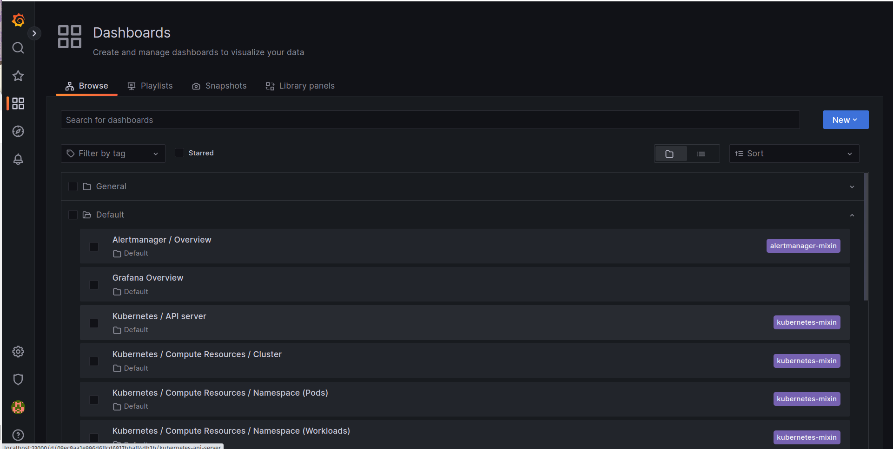
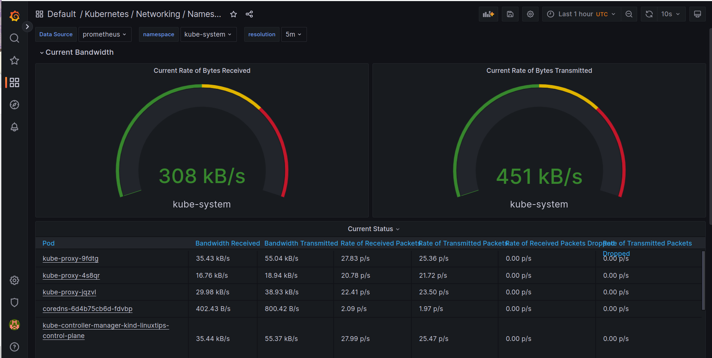
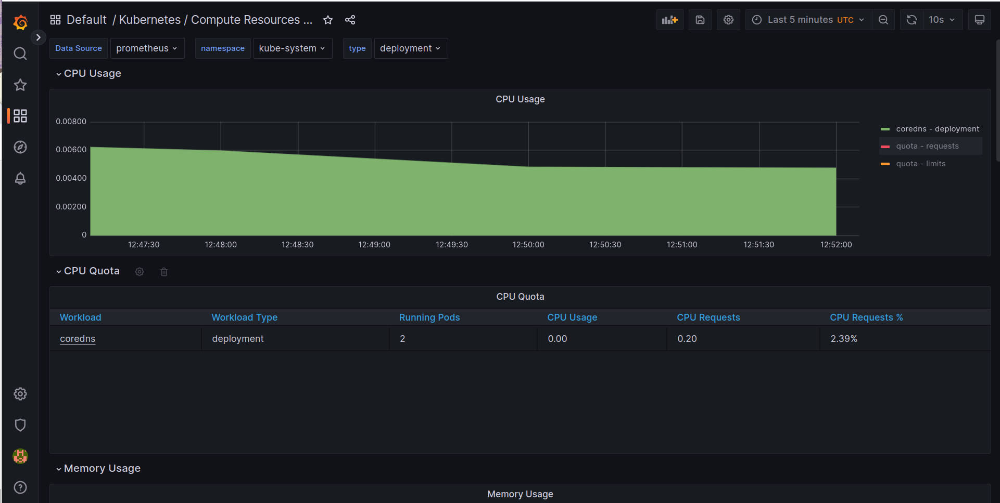
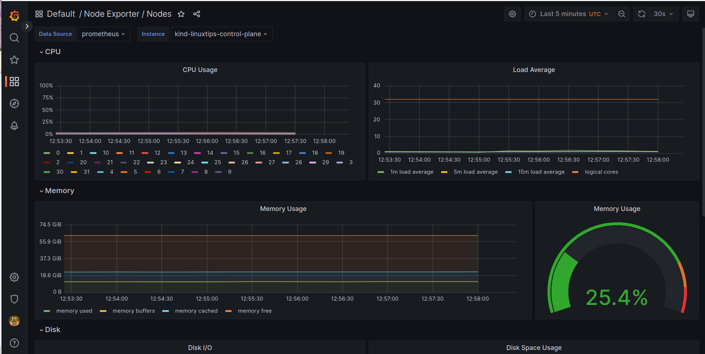
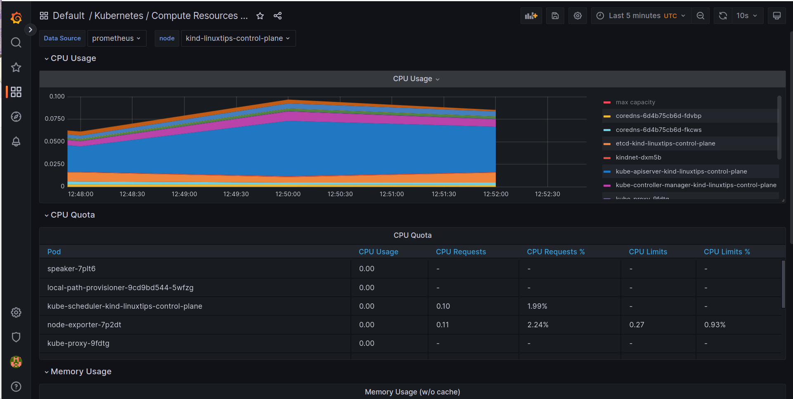
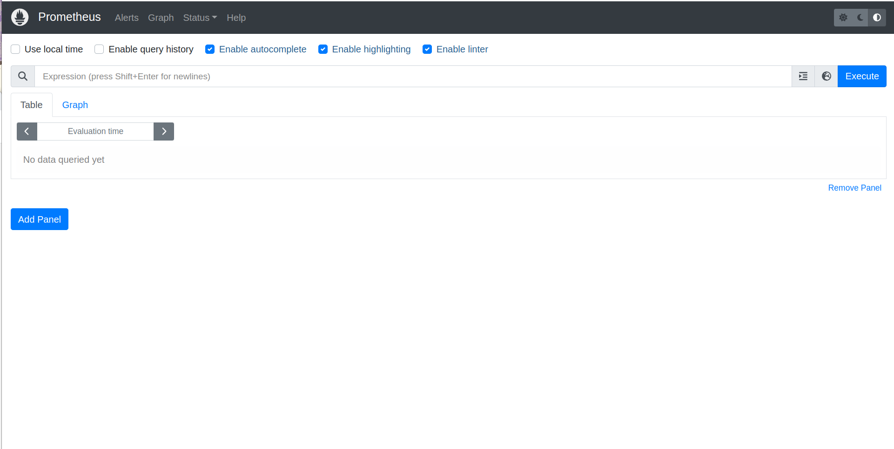

# Descomplicando o Prometheus

## DAY-6

### O que iremos ver hoje

Durante o dia de hoje iremos aprender sobre todas as possibilidades que temos com a utilização do Prometheus + Kubernetes!
Hoje é dia de conhecer o sensacional [kube-prometheus](https://github.com/prometheus-operator/kube-prometheus), projeto esse criado pelos mesmos criadores do [Prometheus Operator](https://github.com/prometheus-operator/prometheus-operator), que nos permite monitorar o nosso cluster de Kubernetes de forma simples e eficiente. Além disso, iremos aprender como utilizar o [Prometheus Adapter](https://github.com/kubernetes-sigs/prometheus-adapter) para que possamos utilizar o nosso querido e lindo Prometheus como fonte de dados para o [Horizontal Pod Autoscaler](https://kubernetes.io/docs/tasks/run-application/horizontal-pod-autoscale/), ou seja, iremos aprender como utilizar o nosso querido e lindo Prometheus para escalar nossos pods de forma automática!
E ainda de quebra você vai aprender como instalar o Kubernetes, mais do que isso, você vai aprender como instalar um cluster EKS! Sim, você vai aprender como instalar um cluster EKS, o cluster de Kubernetes da AWS, através da ferramenta [eksctl](https://eksctl.io/), que é uma ferramenta de linha de comando que nos permite instalar um cluster EKS em minutos!

### Conteúdo do Day-6

<details>
<summary class="summary">DAY-6</summary>

- [Descomplicando o Prometheus](#descomplicando-o-prometheus)
  - [DAY-6](#day-6)
    - [O que iremos ver hoje](#o-que-iremos-ver-hoje)
    - [Conteúdo do Day-6](#conteúdo-do-day-6)
    - [O que é o kube-prometheus](#o-que-é-o-kube-prometheus)
      - [Instalando o nosso cluster Kubernetes](#instalando-o-nosso-cluster-kubernetes)
      - [Instalando o Kube-Prometheus](#instalando-o-kube-prometheus)
      - [Acessando o Grafana](#acessando-o-grafana)
      - [Acessando o Prometheus](#acessando-o-prometheus)
      - [Acessando o AlertManager](#acessando-o-alertmanager)
    - [Chega por hoje!](#chega-por-hoje)
    - [Lição de casa](#lição-de-casa)

</details>


### O que é o kube-prometheus

O kube-prometheus é um conjunto de manifestos do Kubernetes que nos permite ter o Prometheus Operator, Grafana, AlertManager, Node Exporter, Kube-State-Metrics, Prometheus-Adapter instalados e configurados de forma tranquila e com alta disponibilidade. Além disso, ele nos permite ter uma visão completa do nosso cluster de Kubernetes. Ele nos permite monitorar todos os componentes do nosso cluster de Kubernetes, como por exemplo: kube-scheduler, kube-controller-manager, kubelet, kube-proxy, etc.

#### Instalando o nosso cluster Kubernetes

Como dissemos, para esse nosso exemplo iremos utilizar o cluster de Kubernetes da AWS, o EKS. Para instalar o nosso cluster EKS, iremos utilizar a ferramenta [eksctl](https://eksctl.io/), portanto precisamos instalá-la em nossa máquina. Para instalar a ferramenta, basta executar o seguinte comando:

```bash
curl --silent --location "https://github.com/weaveworks/eksctl/releases/latest/download/eksctl_$(uname -s)_amd64.tar.gz" | tar xz -C /tmp
sudo mv /tmp/eksctl /usr/local/bin
```

Precisamos ter o CLI da aws instalado em nossa máquina, para isso, basta executar o seguinte comando:

```bash
curl "https://awscli.amazonaws.com/awscli-exe-linux-x86_64.zip" -o "awscliv2.zip"
unzip awscliv2.zip
sudo ./aws/install
```

Pronto, agora você já tem o `eksctl` e o `aws` instalados em sua máquina.

Para que possamos criar tudo o que precisamos na AWS, é importante que você tenha uma conta na AWS, e que tenha as credenciais de acesso configuradas em sua máquina. Para configurar as credenciais de acesso, basta executar o seguinte comando:

```bash
aws configure
```

O comando acima irá solicitar que você informe a sua `AWS Access Key ID`, a sua `AWS Secret Access Key`, a sua `Default region name`, e o seu `Default output format`. Para saber mais sobre como configurar as credenciais de acesso, basta acessar a [documentação oficial da AWS](https://docs.aws.amazon.com/pt_br/cli/latest/userguide/cli-configure-quickstart.html).


No comando acima estamos baixando o binário do `eksctl` compactado e descompactando ele na pasta `/tmp`, e depois movendo o binário para a pasta `/usr/local/bin`.

Lembrando que estou instando em uma máquina Linux, caso que esteja utilizando uma máquina Mac ou Windows, basta acessar a página de releases do projeto e baixar a versão adequada para o seu sistema operacional.

E enquanto você faz a instalação, vale a pena mencionar que o `eksctl` é uma ferramenta criada pela WeaveWorks, empresa que criou o [Flux](https://fluxcd.io/), que é um projeto de GitOps para Kubernetes, além de ter o Weavenet, que é um CNI para Kubernetes, e o Weave Scope, que é uma ferramenta de visualização de clusters de Kubernetes e muito mais, recomendo que vocês dêem uma olhada nos projetos, é sensacional!

Bem, agora você já tem o `eksctl` instalado em sua máquina, então vamos criar o nosso cluster EKS! Para isso, basta executar o seguinte comando:

```bash
eksctl create cluster --name=eks-cluster --version=1.24 --region=us-east-1 --nodegroup-name=eks-cluster-nodegroup --node-type=t3.medium --nodes=2 --nodes-min=1 --nodes-max=3 --managed
```

O comando acima irá criar um cluster EKS com o nome `eks-cluster`, na região `us-east-1`, com 2 nós do tipo `t3.medium`, e com um mínimo de 1 nó e um máximo de 3 nós. Além disso, o comando acima irá criar um nodegroup chamado `eks-cluster-nodegroup`. O `eksctl` irá cuidar de toda a infraestrutura necessária para o funcionamento do nosso cluster EKS. A versão do Kubernetes que será instalada no nosso cluster será a `1.24`.

Após a criação do nosso cluster EKS, precisamos instalar o `kubectl` em nossa máquina. Para instalar o `kubectl`, basta executar o seguinte comando:

```bash
curl -LO "https://dl.k8s.io/release/$(curl -L -s https://dl.k8s.io/release/stable.txt)/bin/linux/amd64/kubectl"
chmod +x ./kubectl
sudo mv ./kubectl /usr/local/bin/kubectl
```

O comando acima irá baixar o binário do `kubectl` e o colocar na pasta `/usr/local/bin`, e dar permissão de execução para o binário.

Agora que já temos o `kubectl` instalado em nossa máquina, precisamos configurar o `kubectl` para utilizar o nosso cluster EKS. Para isso, basta executar o seguinte comando:

```bash
aws eks --region us-east-1 update-kubeconfig --name eks-cluster
```

Aonde `us-east-1` é a região do nosso cluster EKS, e `eks-cluster` é o nome do nosso cluster EKS. Esse comando é necessário para que o `kubectl` saiba qual cluster ele deve utilizar, ele irá pegar as credenciais do nosso cluster EKS e armazenar no arquivo `~/.kube/config`.

**LEMBRE-SE**: Você não precisa ter o Kubernetes rodando no EKS, fique a vontade para escolher onde preferir para seguir o treinamento.


Vamos ver se o `kubectl` está funcionando corretamente? Para isso, basta executar o seguinte comando:

```bash
kubectl get nodes
```

Se tudo estiver funcionando corretamente, você deverá ver uma lista com os nós do seu cluster EKS. :D


Antes de seguirmos em frente, vamos conhecer algums comandos do eksctl, para que possamos gerenciar o nosso cluster EKS. Para listar os clusters EKS que temos em nossa conta, basta executar o seguinte comando:

```bash
eksctl get cluster -A
```

O parametro `-A` é para listar os clusters EKS de todas as regiões. Para listar os clusters EKS de uma região específica, basta executar o seguinte comando:

```bash
eksctl get cluster -r us-east-1
```

Para aumentar o número de nós do nosso cluster EKS, basta executar o seguinte comando:

```bash
eksctl scale nodegroup --cluster=eks-cluster --nodes=3 --nodes-min=1 --nodes-max=3 --name=eks-cluster-nodegroup -r us-east-1
```

Para diminuir o número de nós do nosso cluster EKS, basta executar o seguinte comando:

```bash
eksctl scale nodegroup --cluster=eks-cluster --nodes=1 --nodes-min=1 --nodes-max=3 --name=eks-cluster-nodegroup -r us-east-1
```

Para deletar o nosso cluster EKS, basta executar o seguinte comando:

```bash
eksctl delete cluster --name=eks-cluster -r us-east-1
```

Mas não delete o nosso cluster EKS, vamos utilizar ele para os próximos passos! hahahah


#### Instalando o Kube-Prometheus

Agora que já temos o nosso cluster EKS criado, vamos instalar o Kube-Prometheus. Para isso, basta executar o seguinte comando:

```bash
git clone https://github.com/prometheus-operator/kube-prometheus
cd kube-prometheus
kubectl create -f manifests/setup
```

Com o comando acima nós estamos clonando o repositório oficial do projeto, e aplicando os manifests necessários para a instalação do Kube-Prometheus. Após a execução do comando acima, você deverá ver uma mensagem parecida com a seguinte:

```bash
customresourcedefinition.apiextensions.k8s.io/alertmanagerconfigs.monitoring.coreos.com created
customresourcedefinition.apiextensions.k8s.io/alertmanagers.monitoring.coreos.com created
customresourcedefinition.apiextensions.k8s.io/podmonitors.monitoring.coreos.com created
customresourcedefinition.apiextensions.k8s.io/probes.monitoring.coreos.com created
customresourcedefinition.apiextensions.k8s.io/prometheuses.monitoring.coreos.com created
customresourcedefinition.apiextensions.k8s.io/prometheusrules.monitoring.coreos.com created
customresourcedefinition.apiextensions.k8s.io/servicemonitors.monitoring.coreos.com created
customresourcedefinition.apiextensions.k8s.io/thanosrulers.monitoring.coreos.com created
namespace/monitoring created
```

Basicamente o que fizemos foi a instalação de alguns CRDs (Custom Resource Definitions) que são como extensões do Kubernetes, e que são utilizados pelo Kube-Prometheus e com isso o Kubernetes irá reconhecer esses novos recursos, como por exemplo o `PrometheusRule` e o `ServiceMonitor` que irei falar mais a frente.

O processo de instalação dos CRDs pode demorar alguns minutos, então vamos aguardar a instalação terminar. :D

Para verificar se a instalação dos CRDs foi concluída, o comando abaixo deverá funcionar,se ainda não funcionar, aguarde alguns minutos e tente novamente.

```bash
kubectl get servicemonitors -A
```

Após a instalação dos CRDs, vamos instalar o Prometheus e o Alertmanager. Para isso, basta executar o seguinte comando:

```bash
kubectl apply -f manifests/
```

Com o comando acima nós estamos aplicando os manifests necessários para a instalação do Prometheus e do Alertmanager. Após a execução do comando acima, você deverá ver uma mensagem parecida com a seguinte:

```bash
alertmanager.monitoring.coreos.com/main created
networkpolicy.networking.k8s.io/alertmanager-main created
poddisruptionbudget.policy/alertmanager-main created
prometheusrule.monitoring.coreos.com/alertmanager-main-rules created
secret/alertmanager-main created
service/alertmanager-main created
serviceaccount/alertmanager-main created
servicemonitor.monitoring.coreos.com/alertmanager-main created
clusterrole.rbac.authorization.k8s.io/blackbox-exporter created
clusterrolebinding.rbac.authorization.k8s.io/blackbox-exporter created
configmap/blackbox-exporter-configuration created
deployment.apps/blackbox-exporter created
networkpolicy.networking.k8s.io/blackbox-exporter created
service/blackbox-exporter created
serviceaccount/blackbox-exporter created
servicemonitor.monitoring.coreos.com/blackbox-exporter created
secret/grafana-config created
secret/grafana-datasources created
configmap/grafana-dashboard-alertmanager-overview created
configmap/grafana-dashboard-apiserver created
configmap/grafana-dashboard-cluster-total created
configmap/grafana-dashboard-controller-manager created
configmap/grafana-dashboard-grafana-overview created
configmap/grafana-dashboard-k8s-resources-cluster created
configmap/grafana-dashboard-k8s-resources-namespace created
configmap/grafana-dashboard-k8s-resources-node created
configmap/grafana-dashboard-k8s-resources-pod created
configmap/grafana-dashboard-k8s-resources-workload created
configmap/grafana-dashboard-k8s-resources-workloads-namespace created
configmap/grafana-dashboard-kubelet created
configmap/grafana-dashboard-namespace-by-pod created
configmap/grafana-dashboard-namespace-by-workload created
configmap/grafana-dashboard-node-cluster-rsrc-use created
configmap/grafana-dashboard-node-rsrc-use created
configmap/grafana-dashboard-nodes-darwin created
configmap/grafana-dashboard-nodes created
configmap/grafana-dashboard-persistentvolumesusage created
configmap/grafana-dashboard-pod-total created
configmap/grafana-dashboard-prometheus-remote-write created
configmap/grafana-dashboard-prometheus created
configmap/grafana-dashboard-proxy created
configmap/grafana-dashboard-scheduler created
configmap/grafana-dashboard-workload-total created
configmap/grafana-dashboards created
deployment.apps/grafana created
networkpolicy.networking.k8s.io/grafana created
prometheusrule.monitoring.coreos.com/grafana-rules created
service/grafana created
serviceaccount/grafana created
servicemonitor.monitoring.coreos.com/grafana created
prometheusrule.monitoring.coreos.com/kube-prometheus-rules created
clusterrole.rbac.authorization.k8s.io/kube-state-metrics created
clusterrolebinding.rbac.authorization.k8s.io/kube-state-metrics created
deployment.apps/kube-state-metrics created
networkpolicy.networking.k8s.io/kube-state-metrics created
prometheusrule.monitoring.coreos.com/kube-state-metrics-rules created
service/kube-state-metrics created
serviceaccount/kube-state-metrics created
servicemonitor.monitoring.coreos.com/kube-state-metrics created
prometheusrule.monitoring.coreos.com/kubernetes-monitoring-rules created
servicemonitor.monitoring.coreos.com/kube-apiserver created
servicemonitor.monitoring.coreos.com/coredns created
servicemonitor.monitoring.coreos.com/kube-controller-manager created
servicemonitor.monitoring.coreos.com/kube-scheduler created
servicemonitor.monitoring.coreos.com/kubelet created
clusterrole.rbac.authorization.k8s.io/node-exporter created
clusterrolebinding.rbac.authorization.k8s.io/node-exporter created
daemonset.apps/node-exporter created
networkpolicy.networking.k8s.io/node-exporter created
prometheusrule.monitoring.coreos.com/node-exporter-rules created
service/node-exporter created
serviceaccount/node-exporter created
servicemonitor.monitoring.coreos.com/node-exporter created
clusterrole.rbac.authorization.k8s.io/prometheus-k8s created
clusterrolebinding.rbac.authorization.k8s.io/prometheus-k8s created
networkpolicy.networking.k8s.io/prometheus-k8s created
poddisruptionbudget.policy/prometheus-k8s created
prometheus.monitoring.coreos.com/k8s created
prometheusrule.monitoring.coreos.com/prometheus-k8s-prometheus-rules created
rolebinding.rbac.authorization.k8s.io/prometheus-k8s-config created
rolebinding.rbac.authorization.k8s.io/prometheus-k8s created
rolebinding.rbac.authorization.k8s.io/prometheus-k8s created
rolebinding.rbac.authorization.k8s.io/prometheus-k8s created
role.rbac.authorization.k8s.io/prometheus-k8s-config created
role.rbac.authorization.k8s.io/prometheus-k8s created
role.rbac.authorization.k8s.io/prometheus-k8s created
role.rbac.authorization.k8s.io/prometheus-k8s created
service/prometheus-k8s created
serviceaccount/prometheus-k8s created
servicemonitor.monitoring.coreos.com/prometheus-k8s created
apiservice.apiregistration.k8s.io/v1beta1.metrics.k8s.io created
clusterrole.rbac.authorization.k8s.io/prometheus-adapter created
clusterrole.rbac.authorization.k8s.io/system:aggregated-metrics-reader created
clusterrolebinding.rbac.authorization.k8s.io/prometheus-adapter created
clusterrolebinding.rbac.authorization.k8s.io/resource-metrics:system:auth-delegator created
clusterrole.rbac.authorization.k8s.io/resource-metrics-server-resources created
configmap/adapter-config created
deployment.apps/prometheus-adapter created
networkpolicy.networking.k8s.io/prometheus-adapter created
poddisruptionbudget.policy/prometheus-adapter created
rolebinding.rbac.authorization.k8s.io/resource-metrics-auth-reader created
service/prometheus-adapter created
serviceaccount/prometheus-adapter created
servicemonitor.monitoring.coreos.com/prometheus-adapter created
clusterrole.rbac.authorization.k8s.io/prometheus-operator created
clusterrolebinding.rbac.authorization.k8s.io/prometheus-operator created
deployment.apps/prometheus-operator created
networkpolicy.networking.k8s.io/prometheus-operator created
prometheusrule.monitoring.coreos.com/prometheus-operator-rules created
service/prometheus-operator created
serviceaccount/prometheus-operator created
servicemonitor.monitoring.coreos.com/prometheus-operator created
```

Com isso fizemos a instalação da Stack do nosso Kube-Prometheus, que é composta pelo Prometheus, pelo Alertmanager, Blackbox Exporter e Grafana. :D
Perceba que ele já está configurando um monte de outras coisas como os ConfigMaps, Secrets, ServiceAccounts, etc. 

Para verificar se a instalação foi concluída, basta executar o seguinte comando:

```bash
kubectl get pods -n monitoring
```

O resultado esperado é o seguinte:

```bash
NAME                                  READY   STATUS    RESTARTS   AGE
alertmanager-main-0                   2/2     Running   0          57s
alertmanager-main-1                   2/2     Running   0          57s
alertmanager-main-2                   2/2     Running   0          57s
blackbox-exporter-cbb9c96b-t8z68      3/3     Running   0          94s
grafana-589787799d-pxsts              1/1     Running   0          80s
kube-state-metrics-557d857c5d-kt8dd   3/3     Running   0          78s
node-exporter-2n6sz                   2/2     Running   0          74s
node-exporter-mwq6b                   2/2     Running   0          74s
prometheus-adapter-758645c65b-54c7g   1/1     Running   0          64s
prometheus-adapter-758645c65b-cmjrv   1/1     Running   0          64s
prometheus-k8s-0                      2/2     Running   0          57s
prometheus-k8s-1                      2/2     Running   0          57s
prometheus-operator-c766b9756-vndp9   2/2     Running   0          63s
```

Pronto, já temos o Prometheus, Alertmanager, Blackbox Exporter, Node Exporter e Grafana instalados. :D
Nesse meu cluster, eu estou com dois nodes, por isso temos dois pods do Node Exporter e dois pods do Prometheus chamados de `prometheus-k8s-0` e `prometheus-k8s-1`.


#### Acessando o Grafana

Agora que já temos o nosso Kube-Prometheus instalado, vamos acessar o nosso Grafana e verificar se está tudo funcionando corretamente. Para isso, vamos utilizar o `kubectl port-forward` para acessar o Grafana localmente. Para isso, basta executar o seguinte comando:

```bash
kubectl port-forward -n monitoring svc/grafana 33000:3000
```

Agora que já temos o nosso Grafana rodando localmente, vamos acessar o nosso Grafana através do navegador. Para isso, basta acessar a seguinte URL: `http://localhost:33000`. Após acessar a URL, você deverá ver uma tela de login do Grafana, como na imagem abaixo:


Para acessar o Grafana, vamos utilizar o usuário `admin` e a senha `admin`, e já no primeiro login ele irá pedir para você alterar a senha. Você já conhece o Grafana, não preciso mais apresenta-los, certo? :D


O importante aqui é ver a quantidade de Dashboards criados pelo Kube-Prometheus. :D 
Temos Dashboards que mostram detalhes do API Server e de diversos componentes do Kubernetes, como Node, Pod, Deployment, etc.



Também temos Dashboards que mostram detalhes do nosso cluster EKS, como por exemplo o dashboard `Kubernetes / Compute Resources / Cluster`, que mostra detalhes de CPU e memória utilizados por todos os nós do nosso cluster EKS.


Dashboards que mostram detalhes do nosso cluster EKS, como por exemplo o dashboard `Kubernetes / Compute Resources / Namespace (Pods)`, que mostra detalhes de CPU e memória utilizados por todos os pods de todos os namespaces do nosso cluster EKS.



Ainda temos Dashboards que mostram detalhes do nosso cluster EKS, como por exemplo o dashboard `Kubernetes / Compute Resources / Namespace (Workloads)`, que mostra detalhes de CPU e memória utilizados por todos os deployments, statefulsets e daemonsets de todos os namespaces do nosso cluster EKS.



Também temos Dashboards que mostram detalhes do nosso cluster EKS, como por exemplo o dashboard `Kubernetes / Compute Resources / Node`, que mostra detalhes de CPU e memória utilizados por todos os nós do nosso cluster EKS.



Também temos Dashboards que mostram detalhes do nosso cluster EKS, como por exemplo o dashboard `Kubernetes / Compute Resources / Pod (Containers)`, que mostra detalhes de CPU e memória utilizados por todos os containers de todos os pods do nosso cluster EKS.



Eu não vou ficar aqui dando spoilers, vai lá você e confere a quantidade enorme de Dashboards que o Kube-Prometheus já vem com ele. \o/

#### Acessando o Prometheus

Agora que já temos o nosso Kube-Prometheus instalado, vamos acessar o nosso Prometheus e verificar se está tudo funcionando corretamente. Para isso, vamos utilizar o `kubectl port-forward` para acessar o Prometheus localmente. Para isso, basta executar o seguinte comando:

```bash
kubectl port-forward -n monitoring svc/prometheus-k8s 39090:9090
```

Pronto, agora já podemos fazer a mesma coisa que fizemos anteriormente para acessar o Grafana, a diferença aqui é que estamos utilizando uma porta diferente, a porta `39090` ao invés da porta `33000` que usamos para o Grafana.

Lembre-se que essa porta é local somente, a porta onde o serviço do Prometheus está rodando é a porta `9090`, e a do Grafana é a porta `3000`.




#### Acessando o AlertManager

Aqui basicamente repetimos o que fizemos para acessar o Prometheus, só que agora para acessar o AlertManager. Para isso, vamos utilizar o `kubectl port-forward` para acessar o AlertManager localmente. Para isso, basta executar o seguinte comando:

```bash
kubectl port-forward -n monitoring svc/alertmanager-main 39093:9093
```

Pronto, agora você já pode acessar o seu serviço de forma simples e segura, sem precisar expor o serviço para o mundo externo. :D

E claro, caso você queira, fique a vontado para criar um ingress para o seu serviço, ou até mesmo um LoadBalancer, caso você esteja utilizando o AWS EKS. :D


### Chega por hoje!

Hoje foi o dia de ver o que é o kube-prometheus e como podemos instala-lo em nosso cluster Kubernetes. De quebra, vimos como criar um cluster EKS através do eksctl e como instalar o kube-prometheus no nosso cluster.

Vimos ainda como acessar o nosso Prometheus, AlertManager e Grafana. Vimos as diversas opções de dashboards disponíveis no Grafana.

Vimos o que é um ServiceMonitor e criamos o nosso primeiro, bem simples, mas somente como exemplo, afinal ainda vamos ver muita coisa sobre ele. :D

### Lição de casa

Você precisa ter o seu cluster criado e o nosso kube-prometheus instalado. :D
Eu não vou ficar pedindo muito hoje, somente que você tenha certeza que seu cluster e seu kube-prometheus estão funcionando corretamente, portanto, acesse as interfaces do Prometheus, AlertManager e Grafana e veja se tudo está tudo lindo! :D

Se divirta! #VAIIII